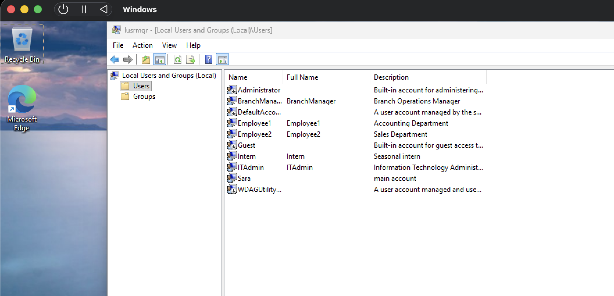
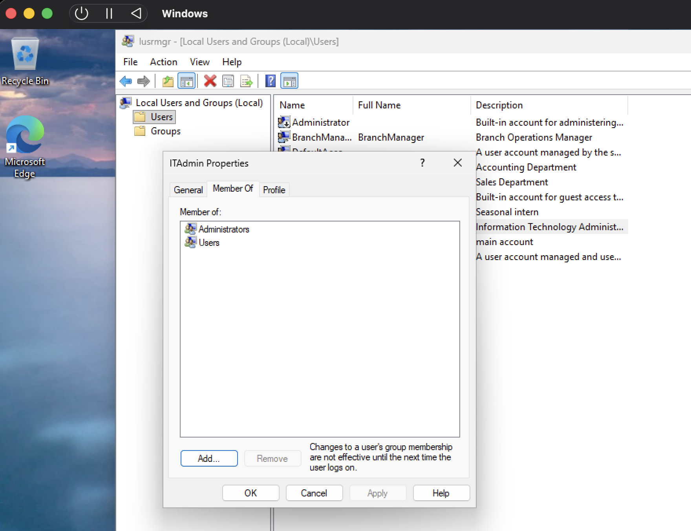
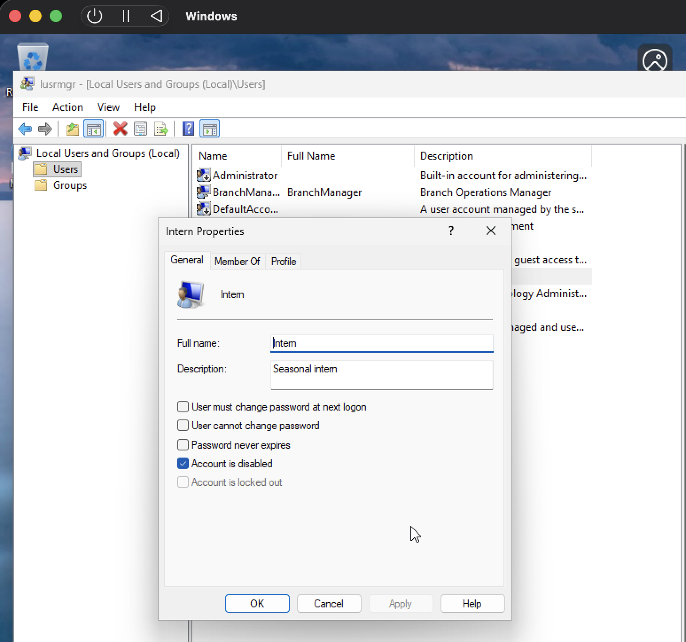
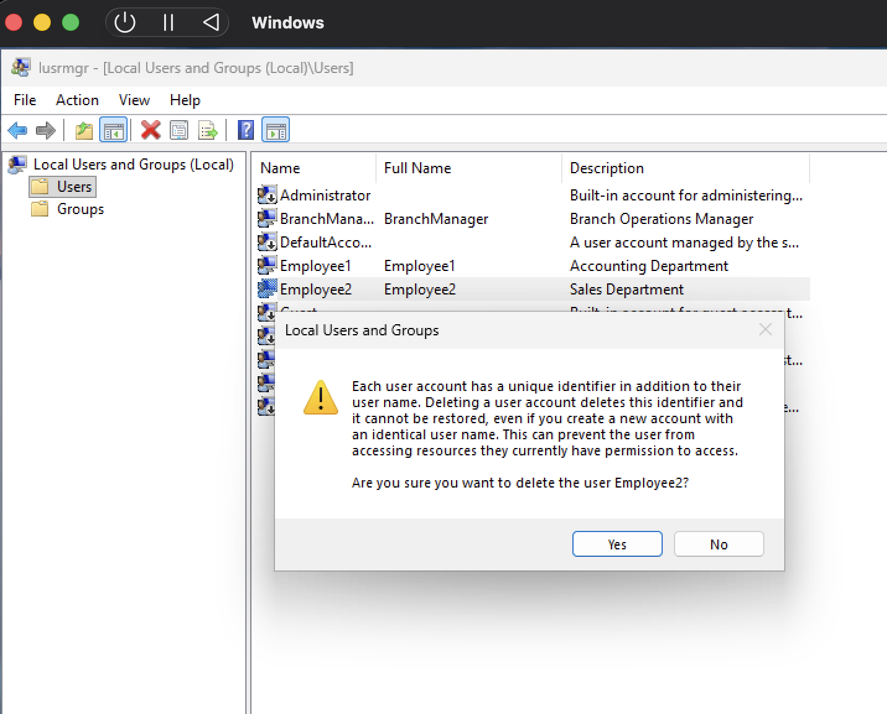

# Windows User & Permission Management

## Objective

This project demonstrates basic Windows user administration tasks commonly performed by IT Support and Systems Administrators.

## Environment

- Windows 11 Virtual Machine
- Local Administrator Account

## Skills Demonstrated

- User Account Management
- Group Membership
- Password Administration
- Windows Administration
- Access Control
- Documentation

## Tasks

- Create local users
- Reset passwords
- Enable and disable accounts
- Manage group membership
- Verify user permissions

## Evidence Screenshots

### User Creation

### Administrator Privileges

### Account Disablement

### Account Removal

